# Mindless Execution
**Work like a javascript engine and get things done**

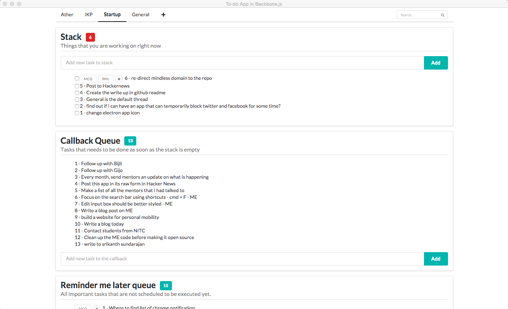

## About - Execute tasks mindlessly
This is a meant to be a simple task manager that is supposed to help you execute tasks mindlessly. This task manager is a loosely modelled on a javascript runtime engine. 

#### Who this is for? 
If you have a number of small tasks(the ones that take 30 mins to 2 hrs to complete) and end up missing a lot of them. 

#### Why is this modelled on Javascript engine?
You get into the state of flow, when you your shuts down part of the brain and focus all blood flow to only certain parts of the brain. The purpose of this app is help you shut down other parts of your brain and focus of on task at hand and mindlessly execute through your tasks. The Stack and the callback queue automatically tells you what tasks you need to focus and execute. 

## Mindless awesomeness

#### 1. Stack
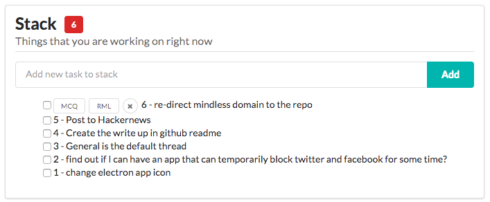

The stack is your list of tasks that you need to focusing on right now. 

#### 2. Subtasks goes to the top of the stack
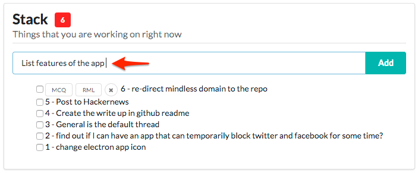

**on hitting enter:**

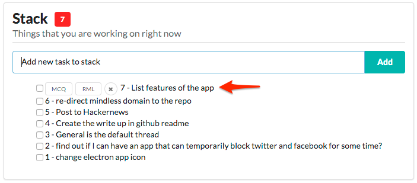

Current tasks might require you to do a subtask. That goes to the top of the stack. 

#### 3. The new subtask just created need not be done immediately
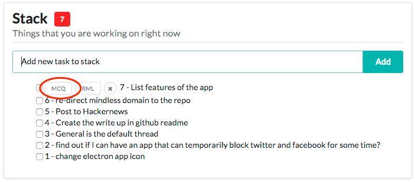

The new subtask that you created might have been triggered by your current task but it might not be necessary to do it right now. Push the task to the callback queue (just like callbacks in Javascript) by clicking on `MCQ` button (stands for 'Move to Callback Queue')

#### 4. Top of the stack is special

The task at the top of the stack is special. You can **move the task to the callback queue** (`MCQ` button) if you cant do the specific task right now (not in the right mood or if necessary resource is not at arms length). Tasks in the callback queue will turn up in the stack when all other tasks are done. 

You can also **move the task to the Remind me later list** (`RML` button). This list is supposed to be the tasks that you dont even want to do in the next iteration. This is basically your other list. You will have to move the task back to the callback queue manually. 

#### 5. Any tasks in the stack can be marked as done.  
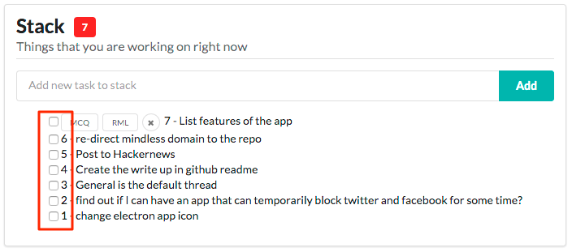

#### 6. Cant do anything with the tasks in the callback queue
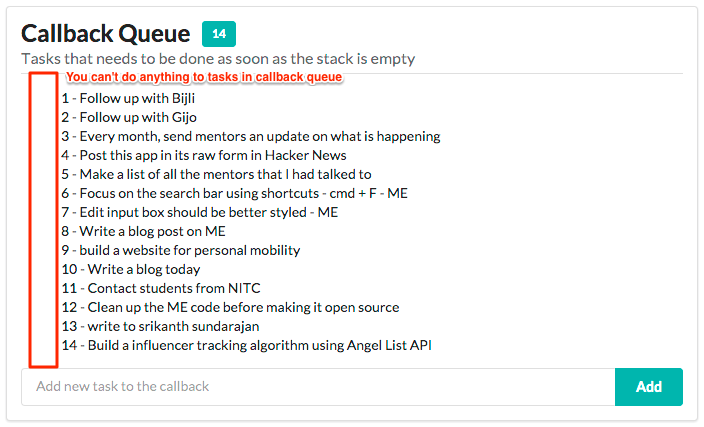

You cant do anything to the tasks in the callback queue. Only when the task gets to the stack, can you do something about it.

This is a feature, not a bug. 

#### 7. Stack empty? one task is auto pushed from the Callback Queue
If you finished all tasks in the stack, one task from the top of the callback queue is pushed to the stack. 

**Initial state:**

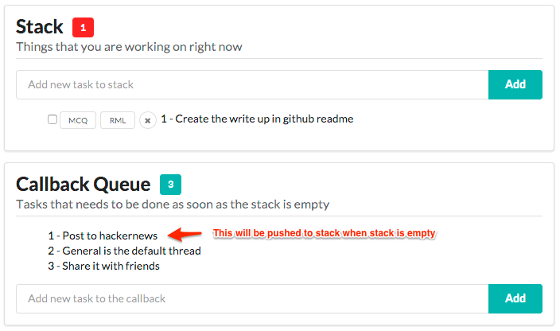

**Marked the last task in stack as done:**

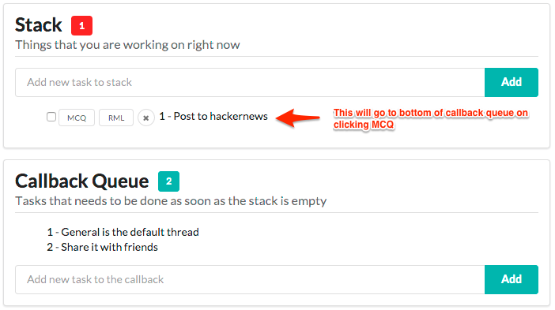

**The top of the callback queue is pushed to the stack:**

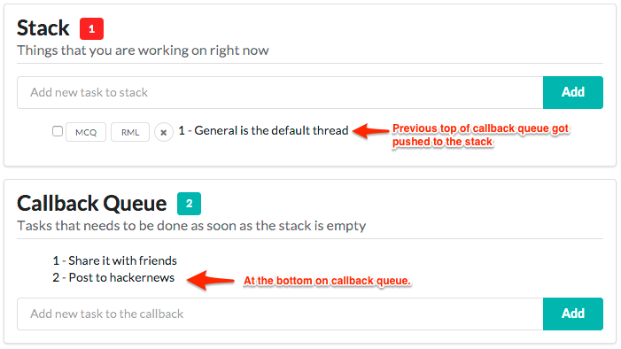

Dont want to do that task now? Move to callback queue. It goes to the bottom of the callback queue and the task that is currently the top of the callback queue will be pushed to the stack. 

#### 8. Remind Me Later list (RML)
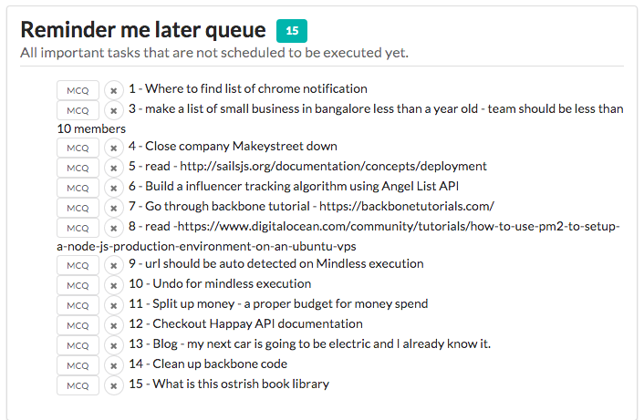

No automated magic here. Move task to callback queue if you choose to bring it to your focus. Recommended to scan your RML list every week. 

#### 9. Your job - Empty the stack ! 
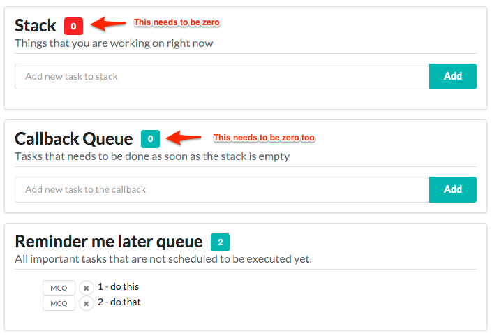

#### 10. Multi thread processing 
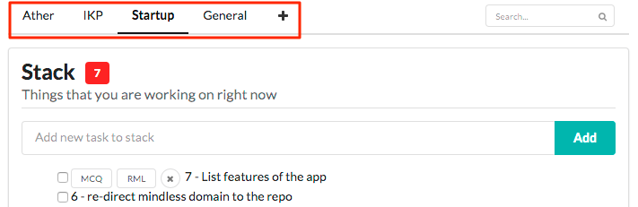

Work on multiple projects simultaniously and still avoid missing details. Multi threading(ie compartmentalizing them) helps you focus your attention on one project/goal at any given time. Also callback automation makes more logical sense when they are compartmentalized properly. Helps you pick up where you left it easier. 

#### 11. Searching 
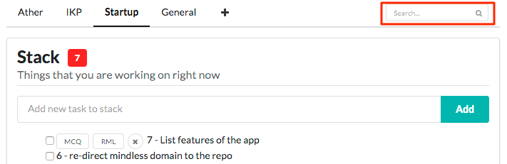

Search for a task in a given thread/compartment.

## To Use

#### Running this in the browser
This app is a single page app. If you open the page in a browser, it should work. The app file is `public/index.html`

Step 1:
Clone this repository - `git clone https://github.com/alexjv89/mindless`
or
Download the zip of this repo. 

Step 2:
Click on `public/index.html` and open that in your browser(use chrome preferably).

#### Running this as an independant app on electron
Run `npm install` and install all the packages.
On the terminal type 
`npm start`

this will run the app inside an electron shell. 

Learn more about Electron and its API in the [documentation](http://electron.atom.io/docs/latest).

#### License [Apache 2.0](LICENSE.md)

